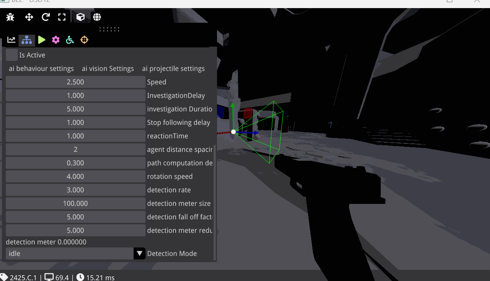
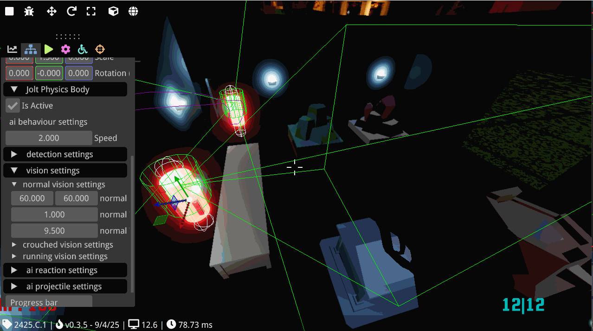

## About the Project
An 8-week custom C++ engine project built by a team of 6 at BUas, on top of Bee, the university's in-house learning engine which provides a basic set of engine features for students to build upon. The engine, originally developed by team Wasp, was later merged with a graphics team called Firefly and continued as Firewasp. At the end of the block the engine was selected as the custom tech for the next group project.


**Team:** 6 programmers (Wasp)    
**Duration:** 8 weeks   
**Engine:** Firewasp (custom C++)   
**Role:** AI programmer   

My contributions were integrating the Recast navigation library into the engine, building an agent behaviour API on top of it, and creating two demos to showcase the system: a COD Zombies-style demo and a PayDay 2 stealth demo.

---
## Recast Navigation

Recast is a navigation library that generates a 3D navmesh from geometry and lets agents traverse it. Integrating it into the engine involved adapting an existing implementation from a teammate's earlier project as a starting point, since documentation and working examples for the library were sparse.


Setup is straightforward from a user perspective. A `.gltf` model is loaded and passed to the system, along with a choice between a `SOLO_MESH` for smaller maps and a `TILE_MESH` for larger ones:

```cpp
auto model = bee::Engine.Resources().Load(
    bee::FileIO::Directory::Assets, "HaloMap/Halo1Navmesh.gltf");
bee::Engine.ECS().CreateSystem(*model, SOLO_MESH, true);
```

### Vertex Transform Fix

One problem encountered early on was that Recast reads raw geometry from the `.gltf` file without applying any node transforms, meaning scale, rotation, and translation defined in Blender were being ignored entirely. To fix this I wrote a function that extracts those transforms from each node and applies them to the vertices before they are passed to Recast:

```cpp
void RecastDetourSystem::TransformVerticesToWorldSpace(
    const tinygltf::Node& node, std::vector& vertices)
{
    for (size_t i = 0; i < vertices.size(); i += 3)
    {
        glm::vec3 localVertex(vertices[i], vertices[i + 1], vertices[i + 2]);
        glm::vec3 scaledVertex{1};
        glm::vec3 rotatedVertex{0};
        glm::vec3 worldVertex{0};

        if (node.scale.size() == 3)
        {
            glm::vec3 scale(node.scale[0], node.scale[1], node.scale[2]);
            scaledVertex = localVertex * scale;
        }
        else scaledVertex = localVertex;

        if (node.rotation.size() == 4)
        {
            glm::quat rotation(
                (float)node.rotation[3],
                (float)node.rotation[0],
                (float)node.rotation[1],
                (float)node.rotation[2]);
            rotatedVertex = rotation * scaledVertex;
        }
        else rotatedVertex = scaledVertex;

        if (node.translation.size() == 3)
        {
            glm::vec3 translation(
                node.translation[0], node.translation[1], node.translation[2]);
            worldVertex = rotatedVertex + translation;
        }
        else worldVertex = rotatedVertex;

        vertices[i]     = worldVertex.x;
        vertices[i + 1] = worldVertex.y;
        vertices[i + 2] = worldVertex.z;
    }
}
```

### Known Limitations

One limitation I was not able to resolve was generating navmeshes from multiple separate `.gltf` nodes. The system works correctly with a single mesh object, but disconnected geometry either gets ignored or causes incorrect results. The likely cause is either that the engine ignores collision from any primitive beyond index 0, or a limitation within Recast itself for disconnected geometry. Given the constraint this meant level meshes needed to be exported as a single object.

---
## Agent Behaviour API

On top of navigation I built an engine-side API that can be inherited to create different AI behaviours without reimplementing common functionality each time. The idea was that the engine exposes generic building blocks — vision checks, shooting, path following — and each game implements its own behaviour by combining them.

The API lives in the engine and is designed to be inherited by a game-side system:

```cpp
class AgentBehaviour : public bee::System, public bee::IEntityInspector
{
public:
    AgentBehaviour() = default;

    static void SetupPhysicsBody(JPH::CapsuleShapeSettings& capsuleSettings,
                          const entt::entity entity,
                          const glm::vec3& position,
                          const JPH::EMotionType& motionType,
                          const JPH::ObjectLayer& inObjectLayer);

    static void AssignBodyId(entt::entity agent, JPH::BodyID body);
    void AlignPhysicsBodyWithTransForm(const bee::Transform agentTransform,
                                       const JPH::BodyID& body);

    bool IsInSight(AgentAi& ai, const glm::vec3 agent_pos,
                   const entt::entity player, const float& distance);
    bool IsInsideFrustum(bee::Transform& agentTransform,
                         const bee::Transform& playerTransForm,
                         const glm::vec2& frustumSize);
    bool IsInRadius(const glm::vec3 agentPos, const glm::vec3 playerPos,
                    const float radius, const float height);

    bool VisionDetection(AgentAi& ai, entt::entity player,
                         bee::Transform& agentTransform,
                         const bee::Transform& playerTransForm,
                         const glm::vec2& frustumSize);

    void DrawRadius(const glm::vec3& agentPos, const float height,
                    const float radius, const bool);
    void DrawFrustum(const glm::vec3& position, const glm::vec3& forward,
                     const glm::vec3& up, const glm::vec2 frustumSize,
                     const float frustumDistance, bool isInside);

    bool ReturnToOrigin(DetourAgent& detour);
    bool StopAndGo(AgentAi& ai, std::vector stopArray, int& index, float dt);

    static void SetState(AgentAi& agent, const AgentAi::agentState state)
        { agent.state = state; }

    void ShootRay(AgentAi& ai, const glm::vec3 agent_pos,
                  const entt::entity player);
    void ShootProj(AgentAi& ai, const bee::Transform AgentTransform,
                   const glm::vec3 direction);
    void DestroyAgent(entt::entity agent);
    void Update(float dt) override = 0;

#ifdef BEE_INSPECTOR
    void OnEntity(entt::entity entity) override;
#endif
};
```

The API started out as general as possible with the intention of being engine-agnostic, but after feedback I shifted toward integrating more Bee-specific types like transforms and Jolt bodies. The inconsistency between older and newer function signatures in the header reflects that shift happening partway through the project.

AI state is stored in an `AgentAi` component with settings grouped by category for both readability and to make eventual serialization easier:

```cpp
struct AgentAi
{
    struct VisionSettings
    {
        glm::vec2 normalFrustumBounds{60, 60};
        glm::vec2 crouchFrustumBounds{75, 75};
        glm::vec2 runFrustumBounds{90, 90};
        float normalVisionRange = 15;
        float crouchVisionRange = 20;
        float runVisionRange = 30;
        float normalDetectionRadius = 1;
        float crouchDetectionRadius = 0.5f;
        float runDetectionRadius = 2;
        float detectionRadiusHeight = 2;
    } vision_parameters;

    struct AiSettings
    {
        float health = 100;
        float damage = 15;
        float reactionTime = 0.5f;
        float investigationDuration = 3;
        float stopFollowDelay = 1;
        int rangedDistance = 4;
        float recompute_delay = 0.3f;
        float speed = 2.f;
        float rotationSpeed = 4.0f;
        float detectionRate = 3.0f;
        float detectionMeter = 100.0f;
        float decectionFalloffFactor = 5;
        float alzheimers = 5;
        float minStopTime = 4;
        float maxStopTime = 8;
        std::vector stopArray{0};
        bool stopMoving = false;
    } ai_settings;

    struct agentProjSettings
    {
        glm::vec3 projectileScale{0.1f, 0.1f, 0.1f};
        float projectileSpeed = 100;
        float firingSpeed = 2;
        float spread = 1;
        float shootDistance = 6;
    } projectile_settings;

    enum agentState { idle, inCombat, investigating, returningToOrigin };
    agentState state = agentState::idle;

    // ... remaining fields
};
```

All settings are exposed through ImGui, giving designers control over vision ranges, detection speed, firing rate, and movement without touching code.



---
## Zombies Demo

The zombies demo is a straightforward showcase of the navigation and agent systems working together. Agents spawn continuously, path to the player using the navmesh, and attack on contact. The player can be hit and agents can be killed.

<center>
<figure style="text-align: center;">
    <video controls style="border: 1px white solid; max-width: 100%;">
        <source src="/assets/media/zambies.mp4" type="video/mp4"/>
    </video>
    <figcaption><em>Zombies demo</em></figcaption>
</figure>
</center>

---
## PayDay 2 Demo

The PayDay 2 demo is the more complex showcase, recreating the stealth detection mechanics of the PayDay 2 guards. I also set up and dressed the level to resemble the Framing Frame job from the game.

### Vision and Detection

Agents use a combination of frustum and radius checks, combined with a line of sight raycast, to determine whether the player is visible. When visible, a detection meter fills at a rate that increases the closer the player is to the agent. When out of sight the meter drains after a short reaction delay.




### State Machine

The agent runs a finite state machine with four states. Detection meter thresholds determine transitions between them:

**Idle:** The agent follows its preset path. If the player leaves vision the meter drains passively.

```cpp
case AgentAi::idle:
{
    if (ai.currentDetectionAmount > 0 && !visible)
    {
        ai.recompute_timer += dt;
        if (ai.recompute_timer >= ai.ai_settings.reactionTime)
            ai.currentDetectionAmount -= ai.ai_settings.reductionRate * dt;
    }
    else ai.recompute_timer = 0;

    agentTransform.SetRotation(detour.GetRotation());
    detour.FollowPath(ai, ai.path, dt);
    break;
}
```

**Investigating:** Triggered when the meter passes 50%. The agent moves to the player's last known position and lingers there before returning to its path. During this phase the agent briefly continues tracking the player to make it harder to simply hide behind cover.

```cpp
case AgentAi::investigating:
{
    if (ai.currentDetectionAmount > 0 && !visible)
    {
        ai.recompute_timer += dt;
        if (ai.recompute_timer >= ai.ai_settings.reactionTime)
            ai.currentDetectionAmount -= ai.ai_settings.reductionRate * dt;
    }
    else ai.recompute_timer = 0;

    Investigate(ai, detour, agentTransform, visible, dt);
    break;
}
```

**In combat:** Triggered when the meter is full. The agent does not revert to earlier states and stays aggressive until eliminated. It moves toward the player but holds a set distance to shoot from, firing projectiles at a configurable rate.

```cpp
case AgentAi::inCombat:
{
    UpdatePath(ai, detour, playerTransform, isAgro, dt);

    glm::vec3 direction = glm::normalize(
        playerTransform.GetTranslation() + ai.playerOffset
        - agentTransform.GetTranslation());

    PayDayCombat(ai, agentTransform, playerTransform, direction, isAgro, dt);
    SetRotation(ai, agentTransform, direction, dt);
    detour.FollowPath(ai, dt, ai.ai_settings.rangedDistance);
    break;
}
```

<center>
<figure style="text-align: center;">
    <video controls style="border: 1px white solid; max-width: 100%;">
        <source src="/assets/vids/return_to_path.mp4" type="video/mp4"/>
    </video>
    <figcaption><em>Agent spotting the player, investigating, then returning to patrol</em></figcaption>
</figure>
</center>

<center>
<figure style="text-align: center;">
    <video controls style="border: 1px white solid; max-width: 100%;">
        <source src="/assets/vids/attack.mp4" type="video/mp4"/>
    </video>
    <figcaption><em>Agent entering combat and maintaining ranged distance</em></figcaption>
</figure>
</center>

<center>
<figure style="text-align: center;">
    <video controls style="border: 1px white solid; max-width: 100%;">
        <source src="/assets/vids/Stealthingk.mp4" type="video/mp4"/>
    </video>
    <figcaption><em>Full gameplay loop played as intended</em></figcaption>
</figure>
</center>

---
## Reflection

The behaviour tree feedback I received after the sprint 3 presentation was something I found genuinely interesting in hindsight. A generic node-based behaviour tree system in the engine would have been a cleaner fit for the kind of composable AI the API was trying to support. The time constraint meant I could not act on it during the project, but it is something I intend to implement independently.

The API design also shifted partway through from being engine-agnostic to being more tightly integrated with the engine architecture. In retrospect starting with that integration in mind would have made the earlier code more consistent and saved some refactoring time.
