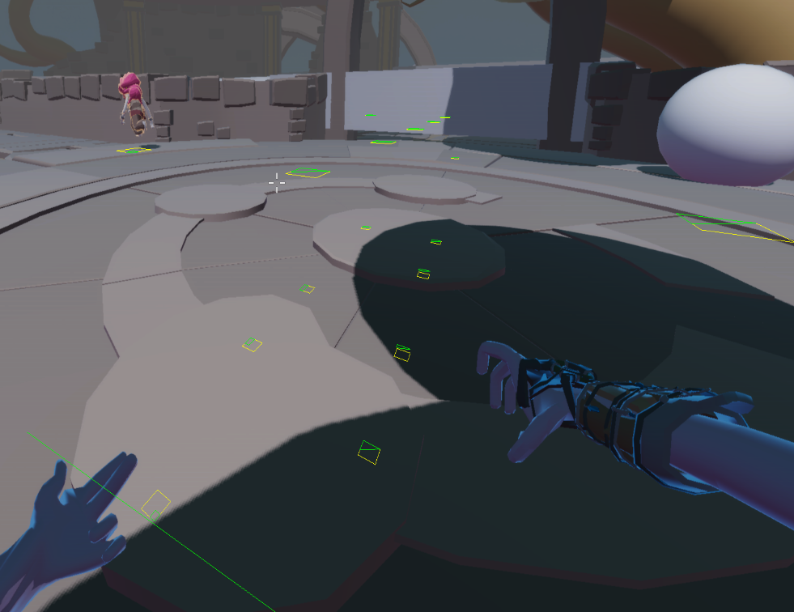

## About the Project

Nakon is a first-person horde shooter inspired by Call of Duty Zombies, built on the custom Firewasp engine over 8 weeks. Players fight through escalating waves of enemies, spending points to unlock weapons, buy perks, and purchase power-ups dropped by enemies.

This project grew directly out of the custom fps engine project. The same engine team carried the codebase forward into the game, so a lot of the engine-level systems used here are ones I built or improved during both phases.

**Team:** 12 people (9 programmers, 3 artists)  
**Duration** 8 weeks    
**Engine:** Custom engine  
**Play it:** [itch.io](https://buas.itch.io/nakon)    

---

## My Role
I was the only designer on the team alongside my programming work. Early in the project I handled the game documentation, worldbuilding, and wrote a short lore piece that gave the team a shared creative direction. On the programming side I owned the interactables system, AI and enemy variants, navigation, wave scaling, and various polish and balance work in the final sprint.

---
## Interactables

The most substantial system I built for Nakon was the interactables: wall buys, perk machines, doors, the upgrade station integration, and enemy drop power-ups. All of these run through a shared interaction system and are placed and configured entirely in the editor.

### Power-up Drops

When an enemy dies it rolls against a set of `PowerupPreset` components placed in the scene. Each preset controls what type of drop it spawns, at what probability, and whether it is active at all. This keeps tuning entirely out of code and lets designers iterate on drop rates without a recompile:

```cpp
struct PowerupPreset
{
    std::string ModelPath = "models/Sphere.gltf";
    Pickup::PickUpType Type;
    float Chance;
    bool Enabled;
    static void Inspector(Entity entity);
};
```


The spawn function collects all eligible presets, picks one at random from that pool, then creates the pickup entity with a sine-driven float animation and a random phase offset so multiple drops in the same spot do not move in sync:

```cpp
void InteractableSystem::TrySpawnPowerUp(vec3 spawnPos)
{
    std::vector<PowerupPreset> eligiblePresets;
    for (const auto [entity, preset] : Engine.ECS().View<PowerupPreset>().each())
    {
        if (preset.Enabled && GetRandomNum(0.0f, 1.0f) <= preset.Chance)
            eligiblePresets.push_back(preset);
    }
    if (eligiblePresets.empty()) return;

    int index = static_cast<int>(GetRandomNumber(0.0f, static_cast<float>(eligiblePresets.size())));
    const auto& chosenPreset = eligiblePresets[index];

    entt::entity powerUp = Engine.ECS().CreateEntity();
    auto& drop = Engine.ECS().CreateComponent<Pickup>(powerUp, chosenPreset.Type);
    drop.yPos = spawnPos.y + 0.6f;
    drop.phaseOffset = GetRandomNumber(0.0f, 2.0f * 3.14f);
    // model, rimlight, audio...
}
```

Each effect type is a component on the player. When a drop is collected the component is created. If the player picks up the same type while it is already active the timer resets rather than stacking. When the duration expires the component removes itself and the effect ends. This makes adding new effect types very simple since each one is fully self-contained:

```cpp
if (auto* instaKill = Engine.ECS().TryGet<Instakill>(playerEntity))
{
    instaKill->Timer += dt;
    if (instaKill->Timer > instaKill->EffectDuration)
    {
        weaponSys.SetInstaKill(false);
        Engine.ECS().RemoveComponent<Instakill>(playerEntity);
    }
}
```

Pickup collection runs a distance check each frame. When the player is close enough, the pickup entity is deleted, the appropriate component is added to the player, and a spatial audio cue plays:

```cpp
const auto dist = distance(playerTransform.GetTranslation(), transform.GetTranslation());
if (dist <= m_pickupRadius)
{
    Engine.SpatialAudio().PlaySound(entity, false);
    Engine.ECS().DeleteEntity(entity);
    switch (pickup.Type)
    {
        case Pickup::PickUpType::eInstaKill:
            weaponSys.SetInstaKill(true);
            Engine.ECS().CreateComponent<Instakill>(playerEntity);
            break;
        case Pickup::PickUpType::eNuke:
            Engine.ECS().CreateComponent<Nuke>(playerEntity);
            aiSys.Nuke();
            break;
        case Pickup::PickUpType::eFreeze:
            aiSys.SetFreezeAgents(true);
            Engine.ECS().CreateComponent<Freeze>(playerEntity);
            break;
        // ...
    }
}
```

<center>
<figure style="text-align: center;">
    <video controls style="border: 1px white solid; max-width: 100%;">
        <source src="/assets/vids/nuke.mp4" type="video/mp4"/>
    </video>
    <figcaption><em>Nuke drop</em></figcaption>
</figure>
</center>

<center>
<figure style="text-align: center;">
    <video controls style="border: 1px white solid; max-width: 100%;">
        <source src="/assets/vids/freeze.mp4" type="video/mp4"/>
    </video>
    <figcaption><em>Freeze drop</em></figcaption>
</figure>
</center>

### Wall Buys and Perks

Wall buys and perk machines use the same interaction logic as the drops. Both are defined as components with an inspector so they can be placed and configured from the editor. The five perks (health boost, double projectiles, faster reload, headshot damage increase, and ammo return on kill) each apply a different passive effect through the weapon and character systems:

```cpp
struct WallBuy
{
    int unlockCost;
    bool unlocked = false;
    enum class Weapons { Default, Shotgun, Rifle } weapons;
    static void Inspector(Entity entity);
};

struct PerkVendor
{
    int Cost = 0;
    bool used = false;
    enum class Perks
    {
        eJuggernog,   // health boost
        eDoubleTap,   // double projectiles fired
        eSpeedCola,   // faster reload
        eDeadshot,    // increased headshot damage
        eVultureAid   // returns ammo to magazine on kill
    } Perk;
    static void Inspector(Entity entity);
};
```

<center>
<figure style="text-align: center;">
    <video controls style="border: 1px white solid; max-width: 100%;">
        <source src="/assets/vids/weapon-unlocking.mp4" type="video/mp4"/>
    </video>
    <figcaption><em>Wall buy weapon unlock</em></figcaption>
</figure>
</center>

<center>
<figure style="text-align: center;">
    <video controls style="border: 1px white solid; max-width: 100%;">
        <source src="/assets/vids/vulture.mp4" type="video/mp4"/>
    </video>
    <figcaption><em>Vulture Aid returning ammo on kill</em></figcaption>
</figure>
</center>

---
## Enemies

Nakon has three enemy variants. All three share the same `AgentAi` component and a single `SpawnAgent` function that sets stats, loads the correct model, sets up animation transitions, and creates the physics body based on the type passed in. Adding a new variant is a matter of adding a case without touching any of the AI logic:

```cpp
case AgentAi::Type::explody:
{
    ai.aiSettings.health = 150;
    ai.aiSettings.damage = 75;
    ai.aiSettings.speed = 0.5f;
    ai.attackSettings.firingSpeed = 3;
    ai.capsuleHalfHeight = 0.9f;
    ai.capsuleRadius = 1.2f;
    ai.deathTimer = 1.5f;
    Engine.ECS().CreateComponent(entity);
    // load model, setup animations, setup physics body...
}
```

Health also scales per wave at spawn time using the round count, so enemies get progressively tougher as the game goes on without needing separate tuning per wave:

```cpp
float scaledHealth = ai.aiSettings.health * ai.aiSettings.healthScale;
ai.aiSettings.health = ai.aiSettings.health +
    ((scaledHealth - ai.aiSettings.health) / ai.aiSettings.RoundScaleFactor) *
    Engine.ECS().GetSystem().GetWaveCount();
```

### Head Hitboxes

Each enemy has a separate sphere-shaped physics body as a child entity for the head, enabling headshot detection. Getting the aim assist raycast to recognise these correctly required a parent check, since a hit on the head hitbox returns the child entity rather than the agent itself:

```cpp
void AgentBehaviour::SetupHeadHitBox(JPH::SphereShapeSettings& sphereSettings,
                                     const entt::entity entity,
                                     glm::vec3 position,
                                     const JPH::EMotionType& motionType,
                                     const JPH::ObjectLayer& inObjectLayer)
{
    auto& bodyInterface = joltSystem->GetBodyInterface();
    const auto& shape = sphereSettings.Create().Get();

    JPH::BodyCreationSettings bodySettings(shape,
                                           bee::physics::ToJolt(position),
                                           JPH::Quat::sIdentity(),
                                           motionType,
                                           inObjectLayer);

    bodySettings.mUserData = static_cast(entity);
    JPH::BodyID bodyID = bodyInterface.CreateAndAddBody(bodySettings, JPH::EActivation::Activate);
    bee::Engine.ECS().CreateComponent(entity, bodyID.GetIndexAndSequenceNumber());
    bee::Engine.ECS().Get(entity).bodyId = bodyID;
}
```

```cpp
// aim assist raycast - check agent directly, or via parent for head hitboxes
if (Engine.ECS().Has(hitEntity)) return hitEntity;

if (auto* transform = Engine.ECS().TryGet(hitEntity))
{
    auto parent = transform->GetParent();
    if (parent != entt::null && Engine.ECS().Has(parent))
        return hitEntity;
}
```


### Attack Logic

When an enemy enters its attack state its movement is stopped and it waits for a cooldown timer. Once the timer is up it performs a frustum check to confirm the player is actually in front of it before firing. After the attack there is a short window before the agent can transition back, giving the animation time to finish cleanly:

```cpp
void AiManager::ZombieCombat(AgentAi& ai, DetourAgent&, dtCrowd* crowd,
                              Transform& agentTransform, Transform& playerTransform,
                              const float& dt)
{
    float finalVelocity[3] = {0, 0, 0};
    crowd->requestMoveVelocity(ai.agentId, finalVelocity);

    if (ai.gunTimer >= ai.attackSettings.firingSpeed && !ai.attacked)
    {
        ai.gunTimer = 0;
        if (IsInsideFrustum(ai,
                            agentTransform.GetTranslation() + ai.visionOffset,
                            playerTransform.GetTranslation()))
        {
            ShootRay(ai, agentTransform.GetTranslation(), player);
        }
        ai.attacked = true;
    }

    if (ai.attacked)
    {
        ai.timer += dt;
        if (ai.timer >= ai.attackSettings.afterAttackDelay)
        {
            ai.timer = 0;
            if (!IsInsideFrustum(ai,
                                 agentTransform.GetTranslation() + ai.visionOffset,
                                 playerTransform.GetTranslation()))
            {
                ai.state = AgentAi::Combat;
                ai.attacked = false;
            }
        }
    }
    else ai.gunTimer += dt;
}
```

<center>
<figure style="text-align: center;">
    <video controls style="border: 1px white solid; max-width: 100%;">
        <source src="/assets/vids/default-agent.mp4" type="video/mp4"/>
    </video>
    <figcaption><em>Standard enemy</em></figcaption>
</figure>
</center>

<center>
<figure style="text-align: center;">
    <video controls style="border: 1px white solid; max-width: 100%;">
        <source src="/assets/vids/explody-agent.mp4" type="video/mp4"/>
    </video>
    <figcaption><em>Exploding variant</em></figcaption>
</figure>
</center>

<center>
<figure style="text-align: center;">
    <video controls style="border: 1px white solid; max-width: 100%;">
        <source src="/assets/vids/tall-agent.mp4" type="video/mp4"/>
    </video>
    <figcaption><em>Tall variant</em></figcaption>
</figure>
</center>

---
## Navigation

The navigation system came from the engine block and was extended during this project. The interesting problem was getting natural crowd separation without Detour's built-in avoidance making enemies feel too polite. The solution was to send velocity through the crowd system to trigger its separation behaviour, then intercept the result before it is applied and route it through the custom path following logic instead. Movement is then constrained to the navmesh surface using `moveAlongSurface`, which prevents agents from drifting off edges on uneven geometry:

```cpp
glm::vec3 desiredVelocity = glm::mix(m_velocity, direction * maxSpeed, smoothing);

float moveTarget[3] = {
    m_position.x + desiredVelocity.x * 0.1f,
    m_position.y + desiredVelocity.y * 0.1f,
    m_position.z + desiredVelocity.z * 0.1f
};

if (dtStatusSucceed(m_navQuery->moveAlongSurface(startRef,
                                                  glm::value_ptr(m_position),
                                                  moveTarget,
                                                  m_queryFilter,
                                                  result,
                                                  visited,
                                                  &visitedCount,
                                                  16)))
{
    glm::vec3 clampedDirection = glm::normalize(glm::make_vec3(result) - m_position);
    m_velocity = clampedDirection * maxSpeed;
}

float finalVelocity[3] = {m_velocity.x, m_velocity.y, m_velocity.z};
m_crowd->requestMoveVelocity(ai.agentId, finalVelocity);
```

An attempt was also made to implement a dynamic tile navmesh to support doors as runtime obstacles. Partial geometry generated but the full implementation was not completed before the deadline.



---
## Wave Scaling

Enemy counts scale per wave using a formula based on Call of Duty Zombies' own scaling, with the tail offset adjusted for Nakon's pacing. The exploding and tall variants ramp in separately from specific thresholds using a power curve, so the composition of each wave shifts meaningfully as the game progresses:

```cpp
m_currentWave.m_zombieCount = (int)floor(
    0.000058f * m_waveCount * m_waveCount * m_waveCount +
    0.074032  * m_waveCount * m_waveCount +
    0.718119  * m_waveCount + 7.738699f);

// exploding variant ramps in from wave 3
if (m_waveCount >= 3)
{
    float ramp = std::pow(((float)m_waveCount - 3) / m_exploderScale, m_ExploderWavePower);
    ramp = std::min(ramp, 1.0f);
    m_currentWave.m_exploderCount = static_cast(
        std::floor(m_currentWave.m_zombieCount * (ramp * m_exploderMaxFraction)));
}

// tall variant ramps in from wave 5
if (m_waveCount >= 5)
{
    float ramp = std::pow(((float)m_waveCount - 5) / m_tallScale, m_tallWavePower);
    ramp = std::min(ramp, 1.0f);
    m_currentWave.m_tallBoyCount = static_cast(
        std::floor(m_currentWave.m_zombieCount * (ramp * m_tallMaxFraction)));
}
```

---
## Polish

In the final sprint I did a balance pass on weapons and enemies based on playtesting, added rimlight highlighting so interactables glow when the player looks at them, and added directional arrows to guide players to the upgrade collection point after playtests consistently showed players getting lost there.

The rimlight system resets all active rimlights at the start of each frame, then re-enables only the one currently being aimed at. This avoids any state getting stuck on if the player looks away mid-interaction:

```cpp
for (auto [_e, interact, rim] : Engine.ECS().View().each())
{
    if (interact.proximityActive) rim.HasRimLighting = false;
}
// then re-enable only the hovered one
if (auto* interact = Engine.ECS().TryGet(parent))
    CheckForRimLightActivation(parent, *interact);
```

<center>
<figure style="text-align: center;">
    <video controls style="border: 1px white solid; max-width: 100%;">
        <source src="/assets/vids/rim.mp4" type="video/mp4"/>
    </video>
    <figcaption><em>Rimlight on interactables</em></figcaption>
</figure>
</center>

<center>
<figure style="text-align: center;">
    <video controls style="border: 1px white solid; max-width: 100%;">
        <source src="/assets/vids/arrow.mp4" type="video/mp4"/>
    </video>
    <figcaption><em>Upgrade arrows</em></figcaption>
</figure>
</center>
